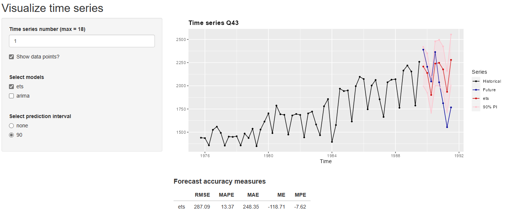

```{r, include = FALSE}
knitr::opts_chunk$set(
  fig.width = 6,
  fig.heigth = 2,
  collapse = TRUE,
  comment = "#>"
)
```

In this document we present the **vctsfr** package, which can be an useful tool for those involved in time series forecasting because it allows you to visually compare the predictions of several forecasting models. The **vctsfr** package is especially convenient when you want to visually compare the predictions of several forecasting methods across a collection of time series.

The **vctsfr** package makes it easy the visualization of collections of time series and, optionally, their future values and forecasts for those future values. The forecasts can include prediction intervals. This package is particularly useful when you have forecasts (maybe from different models) for several time series and you want to display them in order to compare their results.

This package arises from a need of her authors. Frequently, we used several forecasting methods to predict the future values of collections of time series (typically belonging to time series competitions). The usual way of comparing the performance of the forecasting methods is to compute a global measure of forecast accuracy for every method based on all its forecasts for all the series of the competition. However, we miss a way of visually compare the performance of different methods over a particular series. This package fills this gap.

This package also facilitates the visualization of just a collection of time series (without forecasts).

## Visualizing a single time series

If you only want to display a single time series and, optionally, information about its future values and/or a forecast for its future values you can use the `plot_ts()` function. Let us see how it works.

```{r}
library(vctsfr)
plot_ts(USAccDeaths) # plotting a time series
```

By default, `plot_ts()` shows the data points in the time series. However, you can omit them with the `sdp` parameter:

```{r}
plot_ts(USAccDeaths, sdp = FALSE)
```

Let us now display the same time series and a forecast for its next 12 months using the exponential smoothing model implemented in the **forecast** package (`ets()` function):

```{r}
library(forecast)
ets_fit <- ets(USAccDeaths)
ets_f <- forecast(ets_fit, h = 12)
plot_ts(USAccDeaths, prediction = ets_f$mean, method = "ets")
```

If the forecasting method computes prediction intervals, they can be displayed. For example, let's add a 90% prediction interval to the previous forecast:

```{r}
library(forecast)
ets_fit <- ets(USAccDeaths)
ets_f <- forecast(ets_fit, h = 12, level = 90)
plot_ts(USAccDeaths, 
        prediction = ets_f$mean, 
        method = "ets", 
        lpi = ets_f$lower, 
        upi = ets_f$upper, 
        level = 90
)
```

Finally, the actual values that are predicted can also be displayed:

```{r}
timeS <- window(USAccDeaths, end = c(1977, 12))
fut <- window(USAccDeaths, start = c(1978, 1))
ets_fit <- ets(timeS)
ets_f <- forecast(ets_fit, h = length(fut), level = 80)
plot_ts(timeS, 
        future = fut, 
        prediction = ets_f$mean, 
        method = "ets",
        lpi = ets_f$lower, 
        upi = ets_f$upper, 
        level = 80
)
```

Summarizing, the `plot_ts()` function is useful to visualize a time series and, optionally, a forecast for its future values.

In all the functions of the **vctsfr** package the time series parameter, i.e. the historical values of the series, is specified as an object of class `ts`. The future values, forecasts and prediction intervals can be specified as a numeric vector or as an object of class `ts`.

## Visualizing several forecasts

When you want to compare several forecasts for the future values of a time series you can use the function `plot_predictions()`. The forecasts are passed to the function as a list, each component of the list is a forecast and the name of the component is the name of the forecasting method. Let us see an example in which, given a time series, the forecasts for its future values, using the ARIMA and exponential smoothing models implemented in the **forecast** package, are displayed:

```{r}
timeS <- window(USAccDeaths, end = c(1977, 12)) # historical values
fut <- window(USAccDeaths, start = c(1978, 1))  # "future" values
ets_fit <- ets(timeS)                           # exponential smoothing fit
ets_f <- forecast(ets_fit, h = length(fut))     # exponential smoothing forecast
arima_fit <- auto.arima(timeS)                  # ARIMA fit
arima_f <- forecast(arima_fit, h = length(fut)) # ARIMA forecast
plot_predictions(timeS, future = fut, 
                 predictions = list(ets = ets_f$mean, arima = arima_f$mean)
)
```

Looking at the plot, it is clear that both models produce similar and fairly accurate predictions.

## Creating collections of time series

In the previous sections we have seen how to display a time series and forecasts for its future values. However, the main goal of the **vctsfr** package is to facilitate the visualization of collections of time series so that you can visually compare forecasts for their future values.

In this section we study how to build these collections. 
For this purpose, the **vctsfr** package provides three functions:

* `ts_info()` allows you to create an object with information about a time series.
* `prediction_info()` allows you to create an object with information about a forecast.
* `pi_info()` allows you to create an object with information about the prediction interval associated with a forecast.

A collection of time series is a list of objects created with (returned by) the `ts_info()` function. Let's first create a collection storing the historical values of two time series:

```{r}
collection1 <- list(ts_info(USAccDeaths), ts_info(UKDriverDeaths))
```

In the next section we will use the collections built in this section to visualize their information. Next, we use a dataset included in the **Mcomp** package to create another collection of series. The **Mcomp** package contains datasets of forecasting competitions. We are going to create a collection of 18 quarterly time series, with their associated next 12 future values and forecasts for their future values (using the previously applied `ets()` function of the **forecast** package).

```{r}
library(Mcomp)

# select the industry, quarterly series from M1 competition (18 series)
M1_quarterly <- subset(M1, 4, "industry")

# build the collection
collection2 <- vector("list", length = length(M1_quarterly))
for (ind in seq_along(M1_quarterly)) {
  timeS   <- M1_quarterly[[ind]]$x              # time series
  name    <- M1_quarterly[[ind]]$st             # time series's name
  fut     <- M1_quarterly[[ind]]$xx             # future values
  ets_fit <- ets(timeS)                         # ES fit
  ets_for <- forecast(ets_fit, h = length(fut)) # ES forecast
  collection2[[ind]] <- ts_info(timeS,
                                prediction_info("ets", ets_for$mean),
                                future = fut,
                                name = name
  )
}
```

Finally, we use the same dataset of 18 time series to create a collection of time series, with two forecasts (obtained with two different forecasting models) for each series and some prediction intervals associated with each forecast.

```{r}
collection3 <- vector("list", length = length(M1_quarterly))
for (ind in seq_along(M1_quarterly)) {
  t <- M1_quarterly[[ind]]$x                            # time series
  name <- M1_quarterly[[ind]]$st                        # time series's name
  f <- M1_quarterly[[ind]]$xx                           # "future" values
  ets_fit <- ets(t)                                     # ES fit
  ets_f <- forecast(ets_fit, h = length(f), level = 90) # ES forecast
  arima_fit <- auto.arima(t)                            # ARIMA fit
  arima_f <- forecast(arima_fit, h = length(f),         # ARIMA forecast
                      level = c(80, 90)
  )
  collection3[[ind]] <- ts_info(t,
                               future = f,
                               prediction_info("ets", 
                                               ets_f$mean, 
                                               pi_info(90, 
                                                       ets_f$lower, 
                                                       ets_f$upper)
                               ),
                               prediction_info("arima", 
                                               arima_f$mean,
                                               pi_info(80, 
                                                       arima_f$lower[, 1], 
                                                       arima_f$upper[, 1]
                                               ),
                                               pi_info(90, 
                                                       arima_f$lower[, 2], 
                                                       arima_f$upper[, 2]
                                               )
                               ),
                               name = name)
}
```

It can be noted that the exponential smoothing forecasts have a prediction interval, while the ARIMA forecasts have two prediction intervals. Although it does not happen in these examples, different time series in a collection can include forecasts done with different models.

## Visualizing a time series from a collection

Once you have created a collection, you can see the information about one of its series with the `plot_collection()` function. The basic way of using this function is specifying a collection and the number (index) of the series in the collection. Let's see an example using a collection built in the previous section:

```{r}
plot_collection(collection3, number = 3)
```

`plot_collection()` has displayed all available information about the series with index 3, except for the prediction intervals. You can choose to display a subset of the forecasts associated with a time series providing a vector with the names of the forecasting methods you want to select:

```{r}
plot_collection(collection3, number = 3, methods = "ets")
```

Finally, if you display the forecasts of just one forecasting method and this method has prediction intervals, you can display one of its prediction intervals providing its level:

```{r}
plot_collection(collection3, number = 3, methods = "arima", level = 90)
```

Looking at the plot, all predicted future values fall within the prediction interval.

## The web-based GUI for visualizing collections of time series

Although the `plot_collection()` function is handy, the best way of navigating through the different series of a collection is to use the `GUI_collection()` function, which launches a Shiny GUI in a web browser.

```{r, eval=FALSE}
GUI_collection(collection3)
```

This is how the GUI looks like:

{width="90%"}

Using the GUI the user can select:

* Which time series to display.
* If the data points are highlighted.
* Which forecasting methods to display.
* In the case that only one forecast is displayed and this forecast has prediction intervals, which prediction interval to show.

Apart from the time series, the GUI shows information about the forecast accuracy of the displayed forecasting methods. Currently, for each forecasting method the following forecasting accuracy measures are computed:

* RMSE: root mean squared error
* MAPE: mean absolute percentage error
* MAE: mean absolute error
* ME: mean error
* MPE: mean percentage error.
* sMAPE: symmetric MAPE
* MASE: mean absolute scaled error

This way, you can compare the displayed forecasting methods both visually and through forecast accuracy measures.

Next, we describe how the forecasting accuracy measures are computed for a forecasting horizon $h$ ($y_t$ and $\hat{y}_t$ are the actual future value and its forecast for horizon $t$ respectively):

$$
RMSE = \sqrt{\frac{1}{h}\sum_{t=1}^{h} (y_t-\hat{y}_t)^2}
$$
$$
MAPE = \frac{1}{h}\sum_{t=1}^{h} 100\frac{|y_t-\hat{y}_t|}{y_t}
$$
$$
MAE = \frac{1}{h}\sum_{t=1}^{h} |y_t-\hat{y}_t|
$$
$$
ME = \frac{1}{h}\sum_{t=1}^{h} y_t-\hat{y}_t
$$
$$
MPE = \frac{1}{h}\sum_{t=1}^{h} 100\frac{y_t-\hat{y}_t}{y_t}
$$
$$
sMAPE = \frac{1}{h}\sum_{t=1}^{h} 200\frac{\left|y_{t}-\hat{y}_{t}\right|}{|y_t|+|\hat{y}_t|}
$$
$$
MASE = \frac{\frac{1}{h}\sum_{t=1}^{h} |y_t - \hat{y}_t|}{\frac{1}{T-f}\sum_{t=f+1}^{T} |h_t - h_{t-f}|}
$$

In the MASE computation $T$ is the length of the training set (i.e., the length of the time series with historical values), $h_t$ is the t-th historical value and $f$ is the frequency of the time series (1 for annual data, 4 for quarterly data, 12 for monthly data, ...).
